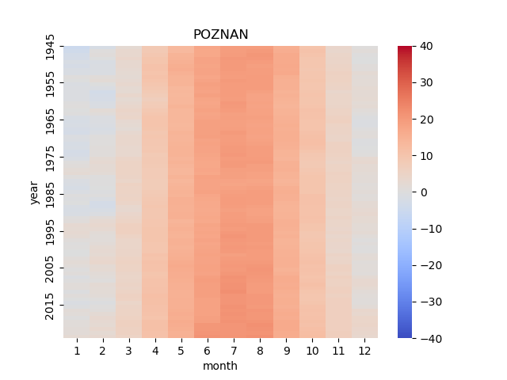
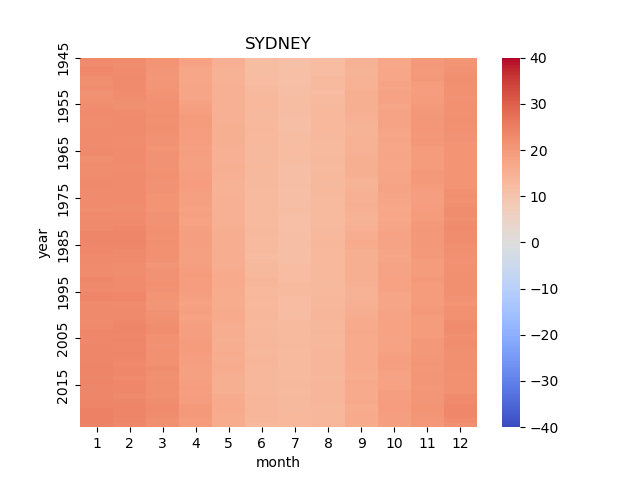
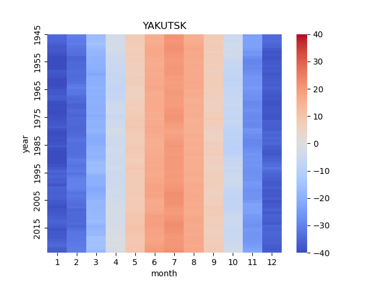
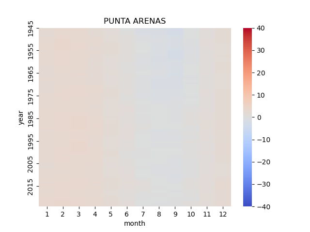

# era5

### Overview

Data loader and visualizer for ECMWF ERA5 dataset.

This script allows to load data from ECMWF API and extract selected variables. Additioanlly there is a small class for visualizing the results as a heatmap.

### Dependencies
- colorama==0.4.4
- numpy==1.21.5
- pygrib==2.1.4
- cdsapi==0.6.1
- tqdm==4.64.1

### Usage
- Add location to locations.csv
- Run main.py

### Samples

